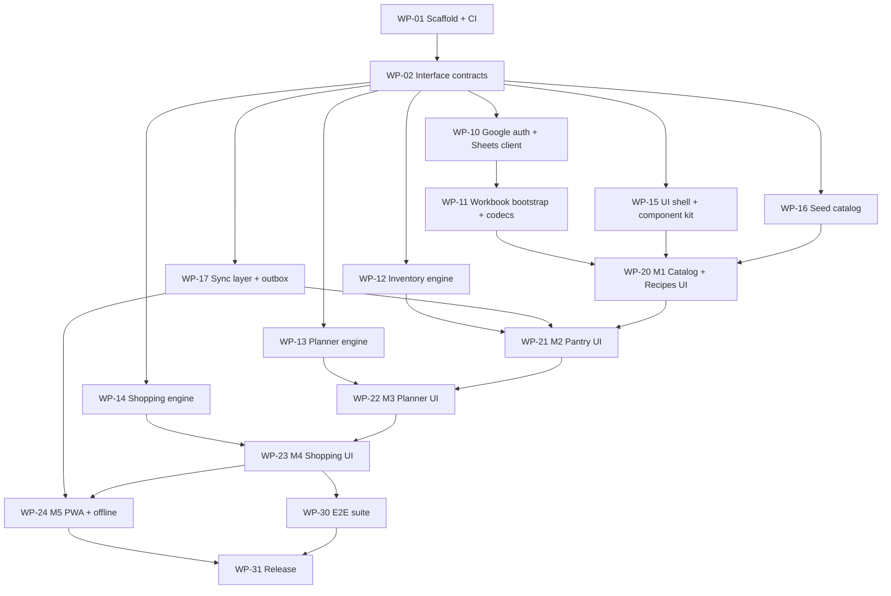

# Implementation Plan — Meal Planner

Companion to `HANDOVER.md` (context, invariants, conventions) and `DESIGN.md`
(authoritative design). This file is the work breakdown for a coordinating agent
dispatching multiple development agents.

Structure: **stages are sequential**; **work packages (WPs) inside a stage run in
parallel** unless a dependency is listed. Each WP states scope, dependencies,
success criteria, and mandatory BDD scenarios (Gherkin). Feature files live under
`features/<wp-id>-<name>.feature` and are executed with `@amiceli/vitest-cucumber`
(unit/engine level) or tagged `@e2e` and executed with Playwright against a
msw-mocked Sheets API.

## Dependency graph



Maximum parallelism: after WP-02 merges, **WP-10, WP-12, WP-13, WP-14, WP-15,
WP-16, WP-17 can all run concurrently** (7 agents). Stage 2 is a milestone
pipeline (WP-20 → 21 → 22 → 23) with WP-24/WP-30 overlapping its tail.

---

## Stage 0 — Foundations (sequential)

### WP-01 · Repo scaffold & CI  *(sequential gate)*

Scope: `git init`; Vite + React + TypeScript (strict) app with hash routing;
ESLint + Prettier; Vitest + `@amiceli/vitest-cucumber`; Playwright configured with
msw; `npm run` scripts (`dev`, `build`, `lint`, `typecheck`, `test`, `test:e2e`);
GitHub Actions workflow: CI (lint/typecheck/test/build) on PR, deploy `dist/` to
Pages on `main`; `VITE_GOOGLE_CLIENT_ID` env plumbing; base path config for Pages.

Success criteria:
- Fresh clone → `npm ci && npm test && npm run build` green.
- CI workflow runs all four checks; deploy job publishes to Pages (may target a
  placeholder page until the repo/Pages prerequisite exists).
- A trivial `.feature` file executes in Vitest and a trivial Playwright test runs
  headless, proving both harnesses.

### WP-02 · Interface contracts  *(sequential gate)*

Scope: pure-type modules every other WP codes against:
- `src/domain/types.ts` — Ingredient, Recipe (kind, tags, status, servings,
  prep/cook minutes), RecipeIngredient, RecipeStep, PlanSlot, InventoryEvent
  (union: purchase/use/spoil/adjust/move/open), Lot, Snapshot, Settings, Meta.
- `src/domain/contracts.ts` — interfaces: `SheetsTransport` (raw ranged
  read/append/update), `WorkbookStore` (typed per-sheet access), `SnapshotStore`,
  `Outbox`, `Clock`, `Rng` (injected randomness for testable generator).
- In-memory fakes for each interface, exported for tests of downstream WPs.

Success criteria:
- Typechecks under `strict`; zero runtime deps besides TS.
- Fakes pass a shared contract test-suite (same suite later reused against real
  implementations).
- Every entity field in `DESIGN.md` §2–3 is representable; reviewed by the
  coordinator against the invariants list before merge.

---

## Stage 1 — Parallel core (7 concurrent WPs, all depend only on WP-02 unless noted)

### WP-10 · Google auth + Sheets transport

Scope: Google Identity Services token client (`drive.file` scope), token refresh,
sign-out; Google Picker integration for opening a shared workbook; `SheetsTransport`
implementation over the Sheets REST API (batch ranged reads, append, update) with
retry/backoff on 429/5xx; multi-workbook registry in localStorage (add/switch).

Success criteria:
- Passes the shared `SheetsTransport` contract suite against msw mocks.
- 429 with `Retry-After` retried with backoff; 401 triggers re-auth flow.
- No Google API call before user gesture; token never persisted to localStorage.

BDD (mocked transport):
```gherkin
Feature: Authentication and workbook access
  Scenario: First sign-in creates no workbook until requested
    Given a signed-out user
    When they sign in with Google
    Then no Sheets API calls are made until they create or pick a workbook

  Scenario: Opening a shared workbook via Picker
    Given a signed-in user with no workbook configured
    When they pick spreadsheet "fam-123" in the Google Picker
    Then "fam-123" is stored in the workbook registry
    And it becomes the active workbook

  Scenario: Rate limit is retried
    Given the Sheets API responds 429 then 200 for a read
    When the transport reads range "InventoryEvents!A2:H"
    Then the read succeeds after one retry
```

### WP-11 · Workbook bootstrap + codecs  *(depends WP-10 for live path; develops against fakes)*

Scope: create-workbook flow writing all sheets with header rows per `DESIGN.md` §3;
schema-version stamp in `Meta`; row↔entity codecs for every sheet (reject unknown
units, malformed rows quarantined with a surfaced warning, never crash the load);
`WorkbookStore` implementation on top of `SheetsTransport`.

Success criteria:
- Bootstrap on an empty account yields a workbook that round-trips: write fixtures
  → read back → deep-equal.
- Codec property tests: encode→decode is identity for all entity types.
- A malformed row (e.g. non-numeric quantity) is skipped and reported, not thrown.

BDD:
```gherkin
Feature: Workbook bootstrap
  Scenario: Creating a fresh workbook
    Given a signed-in user with no workbook
    When they choose "Create new meal planner"
    Then a spreadsheet is created with sheets
      | Meta | Settings | Ingredients | Recipes | RecipeIngredients | RecipeSteps | PlanSlots | InventoryEvents | ShoppingItems |
    And Meta contains schema_version 1 and generation 1

  Scenario: Malformed row does not break loading
    Given the Ingredients sheet contains a row with unit "banana-units"
    When the catalog is loaded
    Then the row is excluded and a data warning lists row number and reason
```

### WP-12 · Inventory engine (pure)

Scope: fold of `InventoryEvent[]` → lots snapshot; FIFO consumption planning;
expiry computation (catalog defaults, opened shelf life, freezer suspension,
manual override); spoilage/adjust/move semantics; leftover-lot creation helper;
cursor + generation reconciliation logic (`applyNewEvents(snapshot, events, meta)`).

Success criteria:
- 100% branch coverage on the fold and FIFO allocator (this is the money logic).
- Property test: folding events in one pass equals incremental folding via cursor.
- Deterministic: no Date.now/Math.random — `Clock` injected.

BDD:
```gherkin
Feature: Inventory fold and FIFO
  Scenario: Partial usage accumulates against the oldest lot
    Given a purchase of 1000 g of rice on 2026-01-01
    And a purchase of 500 g of rice on 2026-01-10
    When 300 g and then 800 g of rice are used
    Then the 2026-01-01 lot is empty
    And the 2026-01-10 lot has 400 g remaining

  Scenario: Opening shortens expiry
    Given tomato has shelf_life_days 7 and opened_shelf_life_days 2
    And a lot of 1 tomato purchased on 2026-03-01
    When the lot is opened on 2026-03-02
    Then its expiry becomes 2026-03-04

  Scenario: Freezing suspends expiry
    Given a lot of chicken expiring 2026-03-05
    When the lot is moved to the freezer on 2026-03-03
    Then its expiry is at least 2026-09-03

  Scenario: Generation mismatch forces full rebuild
    Given a snapshot built at generation 1 with cursor 40
    When events are applied with Meta generation 2
    Then the result signals "full reload required"

  Scenario: Cooking surplus creates a leftover lot
    Given "Chili" scaled to 8 servings is marked cooked for a household of 4
    Then a lot "Leftover: Chili" of 4 portions is created in the fridge
    And its expiry uses the leftover shelf-life default
```

### WP-13 · Planner engine (pure)

Scope: slot-layout expansion from Settings; candidate pools by meal tag and
3-state status; generator: staples first with cross-week round-robin, weighted
random fill (expiring-lot boost, ingredient-overlap boost, N-week repeat
exclusion) with injected `Rng`; reroll/pin operations; household scaling math.

Success criteria:
- Deterministic under seeded `Rng`; weights are pure functions with unit tests
  proving ordering (expiring boost > overlap boost > base).
- Never places a retired recipe or a wrong-meal-tag recipe; proven by property
  test over random catalogs.

BDD:
```gherkin
Feature: Week generation
  Scenario: Staples are guaranteed before random fill
    Given 2 staple dinner recipes and 10 in-rotation dinner recipes
    When a week with 7 dinner slots is generated
    Then both staples appear exactly once

  Scenario: More staples than slots round-robins across weeks
    Given 9 staple dinner recipes and a 7-dinner week
    When two consecutive weeks are generated
    Then every staple appears at least once across the two weeks
    And no staple appears twice before all have appeared once

  Scenario: Recently cooked recipes are excluded
    Given "Carbonara" was cooked 1 week ago and the exclusion window is 3 weeks
    When a week is generated
    Then "Carbonara" is not selected for any slot

  Scenario: Expiring pantry lots boost matching recipes
    Given a lot of chicken expires this week
    And "Roast chicken" is in rotation and uses chicken
    When 1000 weeks are generated with different seeds
    Then "Roast chicken" is selected significantly more often than baseline

  Scenario: Retired recipes never appear
    Given "Liver stew" has status retired
    When a week is generated
    Then "Liver stew" is not selected
```

### WP-14 · Shopping engine (pure)

Scope: needs aggregation across a date range of PlanSlots (scaled, leftovers-slots
excluded); viable-stock subtraction (lot counts only if expiry ≥ cook date), FIFO
allocation across meals in date order; list grouping with per-item meal
provenance; check-off → purchase-event construction (needed qty default, actual
qty override).

Success criteria:
- Allocator is pure and order-stable; property test: total bought + viable stock
  ≥ total needs for every generated case.
- Multi-week ("monthly") ranges supported by the same code path.

BDD:
```gherkin
Feature: Shopping list computation
  Scenario: Shared ingredient across recipes is aggregated
    Given Monday's dinner needs 2 tomatoes and Thursday's lunch needs 3 tomatoes
    And the pantry has no tomatoes
    When the list for that week is computed
    Then it contains one line "tomato: 5 piece" listing both meals

  Scenario: Stock expiring before the cook date is not counted
    Given a lot of 4 tomatoes expiring Tuesday
    And Friday's dinner needs 3 tomatoes
    When the list is computed
    Then it contains "tomato: 3 piece"

  Scenario: Viable stock reduces the list FIFO by cook date
    Given a lot of 4 tomatoes expiring Saturday
    And Tuesday's dinner needs 3 tomatoes and Friday's dinner needs 3 tomatoes
    When the list is computed
    Then it contains "tomato: 2 piece" attributed to Friday's dinner

  Scenario: Leftover slots generate no needs
    Given Wednesday's dinner slot is "Leftover: Chili"
    When the list is computed
    Then no ingredient from the Chili recipe is added for Wednesday

  Scenario: Check-off with a bigger package creates the full lot
    Given the list contains "rice: 400 g"
    When the user checks it off entering 1000 g
    Then a purchase event for 1000 g of rice is created dated today
```

### WP-15 · UI shell + component kit

Scope: app layout (nav, workbook switcher slot, auth status), hash routes for all
sections (stub pages), shared components (entity table, quantity input honoring
canonical units, date picker, confirm dialog, toast/warning surface), responsive
mobile-first styling (in-store one-handed use), light/dark.

Success criteria:
- All routes render stubs; navigation E2E test passes on mobile viewport.
- Quantity input rejects unit-less or negative entries at the component level.
- Axe (a11y) checks pass on shell and kit stories.

### WP-16 · Seed ingredient catalog (data)

Scope: `src/data/seed-catalog.ts` — ~100 common ingredients with canonical unit,
default location, `shelf_life_days`, `opened_shelf_life_days`; plus leftover
pseudo-ingredient defaults; loaded into `Ingredients` at bootstrap.

Success criteria:
- Schema-validated by codec tests; no duplicate names; every entry has plausible
  values (spot-check list reviewed by coordinator).
- Bootstrap inserts it exactly once (idempotent on re-run).

### WP-17 · Sync layer: snapshot store + outbox

Scope: localStorage `SnapshotStore` (snapshot, cursor, generation, per-workbook
keying); incremental sync orchestration using WP-12's `applyNewEvents`; `Outbox`
(append-only write queue, persisted, ordered flush with retry, dedupe by client
event id); online/offline detection; last-write-wins refresh-before-edit helper
for plain-row updates.

Success criteria:
- Contract suite passes against real localStorage (jsdom) and in-memory fake.
- Outbox survives reload; flush is exactly-once under injected transient failures
  (client-generated event ids make appends idempotent).

BDD:
```gherkin
Feature: Offline outbox
  Scenario: Writes queue while offline and flush on reconnect
    Given the client is offline
    When the user checks off "rice: 400 g" and logs usage of 2 tomatoes
    Then 2 events sit in the outbox and the local snapshot reflects both
    When connectivity returns
    Then both events are appended to InventoryEvents in order
    And the outbox is empty

  Scenario: Flush retry does not duplicate events
    Given an outbox flush where the first append times out after the server applied it
    When the flush retries
    Then InventoryEvents contains the event exactly once

  Scenario: Incremental sync uses the cursor
    Given a snapshot with cursor 120 and matching generation
    When sync runs and the sheet has 125 rows
    Then only rows 121-125 are fetched and folded
```

---

## Stage 2 — Feature assembly (milestone pipeline; each WP is one dev agent, UI-heavy)

### WP-20 · M1: Catalog + Recipes UI  *(needs WP-11, WP-15, WP-16)*

Scope: ingredients catalog browse/edit; recipe CRUD — cooked and bought kinds,
meal tags, servings, prep/cook minutes, ingredient lines (canonical-unit picker),
steps editor; 3-state vote control on the recipe card; cooked-history display
(reads PlanSlots states); create/pick workbook onboarding flow wired to WP-10/11.

Success criteria: a real user can onboard, get the seeded catalog, and manage
recipes end-to-end against a live workbook (manual smoke) and mocked E2E in CI.

BDD (`@e2e`):
```gherkin
Feature: Recipe management
  Scenario: Creating a bought meal
    Given a signed-in user with an active workbook
    When they create a recipe "Store lasagna" of kind "bought"
      with cook time 50 minutes and steps "375 degrees, 30 min covered, 20 uncovered"
    Then the recipe saves with prep time 0
    And a catalog ingredient "Store lasagna" with unit "piece" is linked

  Scenario: Retiring a recipe
    When the user sets "Liver stew" status to retired
    Then "Liver stew" shows as retired in the recipe list
```

### WP-21 · M2: Pantry UI  *(needs WP-12, WP-17, WP-20)*

Scope: pantry view grouped by ingredient with lots, quantities, locations,
expiry badges (expiring-soon surfaced); manual add-lot ("already in my pantry");
manual usage/spoilage/adjust/move/open actions; data-warning surface.

BDD (`@e2e`):
```gherkin
Feature: Pantry management
  Scenario: Adding existing pantry stock
    When the user adds 500 g of rice located in the pantry
    Then the pantry shows a rice lot of 500 g with expiry from catalog defaults

  Scenario: Expiring items are surfaced
    Given a lot of milk expiring in 2 days
    Then the pantry view lists milk under "Expiring soon"
```

### WP-22 · M3: Planner UI  *(needs WP-13, WP-21)*

Scope: week view with configurable slots (Settings editor for slot layout,
household size, exclusion window N); Generate week; per-slot reroll/pin/manual
pick/scale override; leftover slots; Mark-cooked flow with confirm/tweak screen
producing usage events + leftover lot.

BDD (`@e2e`):
```gherkin
Feature: Weekly planning
  Scenario: Generating and adjusting a week
    Given staples and rotation recipes exist
    When the user generates next week
    Then every configured slot is filled respecting meal tags
    When they pin Tuesday's dinner and reroll Wednesday's dinner
    Then Tuesday is unchanged and Wednesday differs from its previous recipe

  Scenario: Mark cooked deducts pantry and creates leftovers
    Given Tuesday's dinner "Chili" is scaled to 8 servings for a household of 4
    When the user marks it cooked and confirms suggested amounts
    Then usage events are appended for each ingredient FIFO
    And a "Leftover: Chili" lot of 4 portions appears in the pantry
    And "Chili" appears in cooked history
```

### WP-23 · M4: Shopping UI  *(needs WP-14, WP-22)*

Scope: range picker (week/multi-week); generated list grouped with provenance
tooltips; live recompute on plan change; in-store mode (large touch targets,
check-off with quantity override creating the lot via outbox); persisted checked
state in `ShoppingItems`.

BDD (`@e2e`):
```gherkin
Feature: Shopping trip
  Scenario: The full loop
    Given a planned week needing 400 g of rice and the pantry has 0 g
    When the user opens the shopping list for that week
    Then it shows "rice: 400 g"
    When they check it off entering 1000 g
    Then the item shows as bought
    And the pantry gains a 1000 g rice lot
    And regenerating the list shows no rice line
```

### WP-24 · M5: PWA + offline hardening  *(needs WP-17; final validation needs WP-23)*

Scope: web manifest, icons, service worker (app-shell precache, versioned
updates with reload prompt); offline banner; outbox status UI; Lighthouse PWA
pass; store-aisle smoke script (offline check-off → reconnect → verify sheet).

BDD (`@e2e`, Playwright offline emulation):
```gherkin
Feature: Offline store trip
  Scenario: Checking off while offline
    Given the app is installed and the shopping list is loaded
    And the network goes offline
    When the user checks off "rice: 400 g"
    Then the item shows as bought with a "pending sync" indicator
    When the network returns
    Then the purchase event reaches the workbook and the indicator clears
```

---

## Stage 3 — Hardening & release

### WP-30 · Cross-feature E2E suite  *(needs WP-23; runs alongside WP-24)*

Scope: consolidate all `@e2e` features into a stable CI suite over the msw Sheets
mock; add multi-client scenario (two browser contexts, one workbook: concurrent
appends both land; plain-row LWW edit warns on stale save); add generation-bump
scenario (client rebuilds cleanly).

Success criteria: suite green and non-flaky (3 consecutive CI runs), runtime
< 10 min.

### WP-31 · Release  *(needs WP-24, WP-30)*

Scope: production Pages deploy with real `VITE_GOOGLE_CLIENT_ID`; onboarding
polish (empty states, error copy); `README.md` (user setup incl. Google Cloud
prerequisites from `HANDOVER.md` §7, sharing how-to); tag `v1.0.0`.

Success criteria: product owner completes the full loop on the deployed site with
a real Google account and workbook: onboard → recipes → pantry → generate week →
shop → mark cooked → leftovers — without touching the browser console.

---

## Coordinator checklist

1. WP-01 → WP-02 sequentially; review WP-02 against `HANDOVER.md` §4 invariants.
2. Fan out WP-10…WP-17 (7 agents, separate worktrees). Integrate in the order
   listed in `HANDOVER.md` §6 as PRs land; run full suite after each merge.
3. Pipeline WP-20 → 21 → 22 → 23; start WP-24 as soon as WP-17 is merged and
   finish its validation after WP-23; run WP-30 alongside WP-24.
4. Gate every merge on the WP's success criteria and mandatory scenarios.
5. Park anything blocked on user prerequisites (§7) and report it; never fake a
   Google credential.
